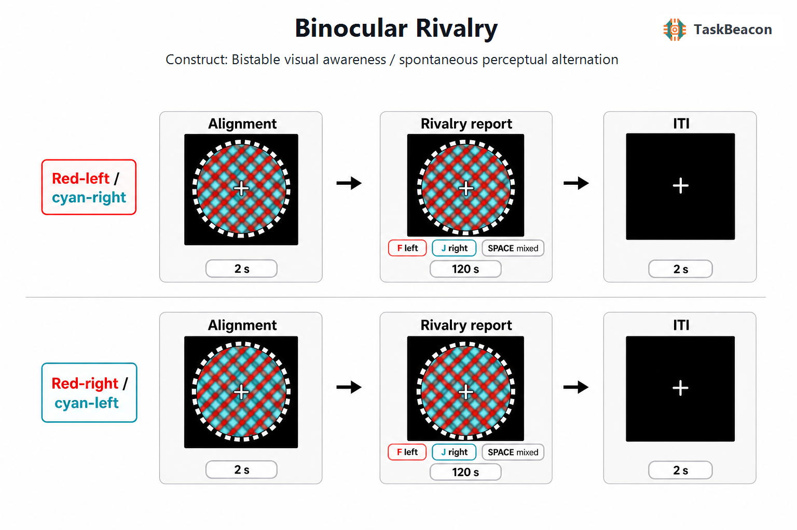

# Binocular Rivalry

| Field                | Value                        |
|----------------------|------------------------------|
| Name | Binocular Rivalry |
| Version | v0.1.0 |
| URL / Repository | https://github.com/TaskBeacon/T000103-binocular-rivalry |
| Short Description | Continuous reporting of spontaneous perceptual alternations during red-cyan dichoptic grating rivalry |
| Created By | TaskBeacon |
| Date Updated | 2026-08-23 |
| PsyFlow Version | 0.1.12 with multi-response capture support |
| PsychoPy Version | 2025.1.1 or compatible |
| Modality | Behavior |
| Language | Chinese |
| Voice Name | zh-CN-YunyangNeural (configured; voice disabled) |

## 1. Task Overview

This task measures spontaneous changes in visual awareness while the physical stimulus remains constant. Red and cyan sinusoidal gratings with opposing orientations are delivered to different eyes through anaglyph glasses. Participants continuously report whether the left-tilted grating, right-tilted grating, or a mixed/patchwork percept is currently dominant. Primary outputs are the time-stamped report sequence, percept dominance intervals, predominance fractions, and left-right alternation rate.

**Required hardware:** red-cyan anaglyph glasses with the red filter over the left eye and cyan filter over the right eye. A mirror stereoscope or another dichoptic device can be used only after adapting and documenting the presentation geometry. Before data collection, calibrate `red_gain` and `cyan_gain` for the specific monitor and filters, and verify channel separation on the alignment screen.

## 2. Task Flow



### Block-Level Flow

| Step | Implementation |
|---|---|
| Configuration and participant setup | `main.py` loads the selected human/QA/simulation profile, collects participant data, initializes the PsychoPy window and trigger runtime, and registers the task-specific anaglyph stimulus. |
| Hardware instructions | `instruction` explains red-left/cyan-right filter placement, fixation, and the F/J/space state-report mapping. |
| Alignment check | `alignment_check` shows red and cyan markers inside an achromatic fusion frame so the participant can verify both channels and reduce diplopia. |
| Practice | A 12-s `practice_rivalry` window uses the same gratings and response semantics as analyzed trials; practice events are not exported as task trials. |
| Block scheduling | Two blocks are run. Each block contains both color-to-orientation mappings once, generated with equal weights and randomized order by `BlockUnit.generate_conditions(...)`. |
| Block break | After block 1, a neutral summary reports response count and alternation rate, followed by a self-paced rest. |
| Completion | A session summary is displayed; all logical trial rows are written to CSV. |

### Trial-Level Flow

| Phase | Duration | Visible stimulus and behavior |
|---|---:|---|
| `alignment_fixation` | 2 s | The condition-specific red/cyan grating composite, achromatic fusion frame, and central fixation appear without accepting responses. |
| `rivalry_report` | 120 s fixed | The physical display remains constant. Every F (left tilt), J (right tilt), and space (mixed) keydown is retained with its onset-relative timestamp; a response never ends the phase. |
| `iti` | 2 s | A small central fixation appears on black before the next trial. |

### Controller Logic

| Component | Rule |
|---|---|
| Adaptive controller | None. Stimulus contrast, duration, and condition scheduling do not adapt to responses. |
| Trial identity | Global `trial_id` values come from `psyflow.next_trial_id()`. |
| Condition generation | Equal config weights are resolved by `TaskSettings.resolve_condition_weights()`; each two-trial block contains both mappings. |
| Response runtime | PsyFlow owns fixed-window timing, key collection, key-specific triggers, QA injection, and phase-state persistence. |

### Other Logic

| Component | Rule |
|---|---|
| Duplicate reports | Raw repeated events are preserved; consecutive identical states are collapsed only for derived dominance intervals. |
| Boundary intervals | Time before the first report and after the last report is not included in median dominance duration because one boundary is unknown. |
| Mixed states | Space marks mixed/patchwork perception. Mixed intervals contribute to mixed fraction but are skipped when counting left-right alternations. |
| No report | A trial with no valid event is retained as `no_report`; no percept is imputed. |

## 3. Configuration Summary

Settings below come from `config/config.yaml`.

### a. Subject Info

| Field | Meaning |
|---|---|
| `subject_id` | Three-digit participant identifier |
| `age` | Participant age, constrained to 18-80 |

### b. Window Settings

| Parameter | Value |
|---|---|
| Size | 1280 x 800 pixels |
| Units | Degrees of visual angle |
| Background | Black |
| Fullscreen | False by default; sites should enable for formal collection |
| Monitor width / distance | 35.5 cm / 57 cm |

### c. Stimuli

| Name | Type | Description |
|---|---|---|
| `instruction` | Text | Chinese hardware and continuous-report instructions in SimHei |
| `alignment_check` | PsychoPy composite | Red/cyan visibility markers, shared white frame, and central cross |
| `anaglyph_rivalry` | Generated PsychoPy `ImageStim` composite | Two independent RGB-channel sinusoidal gratings, 2 cpd, -60/+60 deg, 8-deg circular aperture |
| `fusion_frame` | PsychoPy rectangles | 10-deg alternating-luminance achromatic frame around the rivalry aperture |
| `fixation` | Circle/text primitives | Central binocular fixation target |
| `block_break`, `good_bye` | Text | Neutral recording summaries without correctness feedback |

### d. Timing

| Phase | Duration |
|---|---:|
| Alignment before each trial | 2 s |
| Practice rivalry | 12 s |
| Analyzed rivalry report | 120 s |
| Inter-trial interval | 2 s |

### e. Triggers

| Event | Code |
|---|---:|
| Experiment start / end | 1 / 99 |
| Instruction / alignment / practice | 5 / 6 / 7 |
| Block start / end | 10 / 90 |
| Trial alignment | 20 |
| Red-left/cyan-right rivalry | 31 |
| Red-right/cyan-left rivalry | 32 |
| Left / right / mixed report | 41 / 42 / 43 |
| No report | 44 |
| ITI | 50 |

### f. Adaptive Controller

| Parameter | Value |
|---|---|
| Controller | None |
| Condition weights | Equal, one trial of each mapping per block |
| Display adaptation | None during a trial |

## 4. Methods (for academic publication)

Participants completed a binocular-rivalry task while wearing red-cyan anaglyph glasses with the red filter over the left eye and the cyan filter over the right eye. Before measurement, participants viewed a channel-visibility and alignment display and completed a short practice. During analyzed trials, spatially coincident red and cyan sinusoidal gratings were shown within an 8-deg circular aperture. Both gratings had a spatial frequency of 2 cycles/degree and opposing orientations of -60 and +60 degrees. An achromatic 10-deg fusion frame and central fixation target remained visible. The assignment of color channel to orientation was counterbalanced with two mappings.

The experiment comprised two blocks of two 120-s rivalry trials. Both mappings appeared once per block in randomized order. Participants pressed F whenever the left-tilted percept became dominant, J whenever the right-tilted percept became dominant, and the spacebar whenever a mixed or patchwork percept became dominant. Every response and its time relative to display onset was recorded while the stimulus remained continuously visible. No response was scored as correct or incorrect, and no trial-level feedback was provided. Each analyzed rivalry interval was preceded by 2 s of alignment viewing and followed by a 2-s fixation interval.

Consecutive duplicate state reports were retained in raw data and collapsed for derivation of percept intervals. Dominance intervals were defined between successive cleaned state reports; incomplete intervals before the first and after the last report were excluded from median-duration estimates. Mixed states were analyzed separately and skipped when counting alternations between left- and right-tilted dominance. The task reports predominance fractions, median dominance durations, and alternations per minute. Filter transmission differs across displays, so red and cyan channel gains must be calibrated and documented at each site before inferential use.

### Running the Task

```powershell
python main.py human
python main.py qa --config config/config_qa.yaml
python main.py sim --config config/config_scripted_sim.yaml
python main.py sim --config config/config_sampler_sim.yaml
```

The local Python task is canonical. The matching browser task is `H000103-binocular-rivalry` and preserves the same conditions, timing, report semantics, and derived-data meaning.
